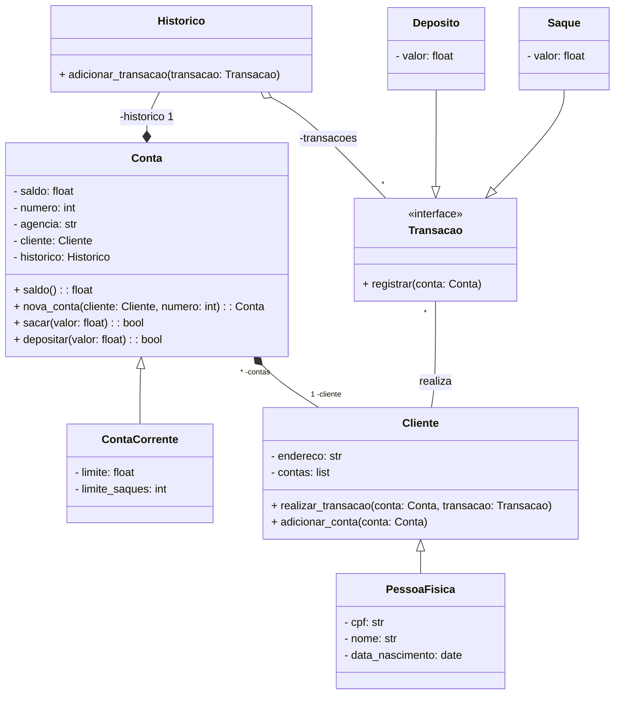

# Desafio!!!

- Iniciar a modelagem do sistema bancário em POO. Adicionar classes para cliente e as operações bancárias: Deposito e saque.
- Atualizar a implementação do sistema bancário, para armazenar os dados de clientes e contas bancárias em objetos ao invés de dicionários. O código deve seguir o modelo de classes UML a seguir.

